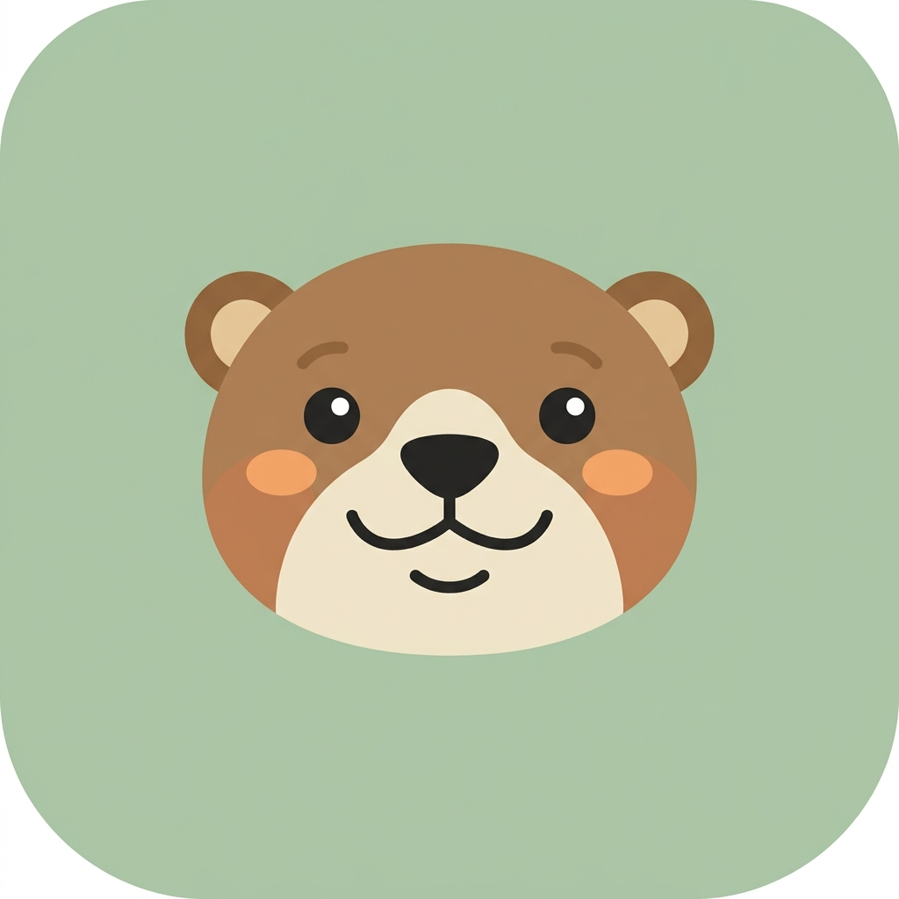
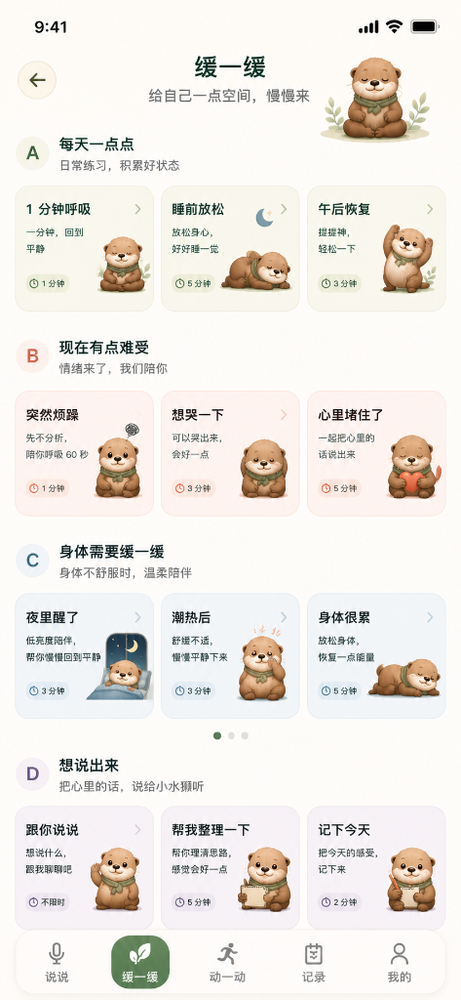
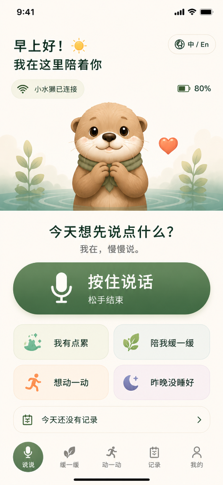
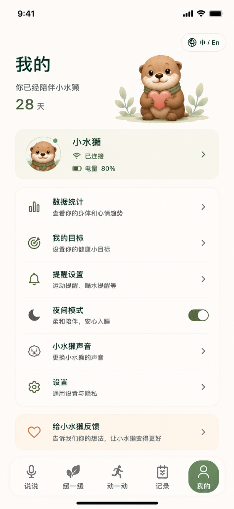
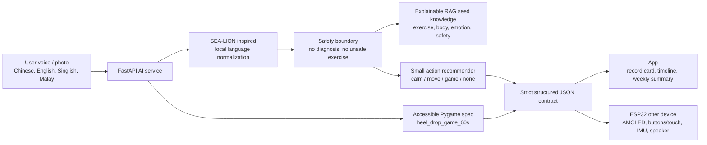

<div align="center">
  
  <h1>🦦 Her Otta · Lah</h1>
  <p><strong>Singapore OtterAI Menopause Companion</strong></p>
  
  [](https://pycon.sg)
  [](https://fastapi.tiangolo.com)
  [](https://reactjs.org)
  [](https://www.espressif.com/)
</div>

<br/>

**Track:** PyCon Singapore 2026 Hackathon Open Track / Creative Track  
**Submission Repositories:**
- 🏆 Main submission repo: [AIPensieve/Her-Otta-Lah-PyCon26Hackathon](https://github.com/AIPensieve/Her-Otta-Lah-PyCon26Hackathon)
- 💻 Team integration repo (Hardware + Software): [https://github.com/clover475/Her-Otta-Lah-PyCon-Singapore-2026-Hackathon) *(You are here)*

---

## 📖 Project Description & Value Proposition

**Her Otta · Lah** is an AI-powered, hardware-software integrated health companion specifically architected for menopausal and postmenopausal women (aged 40-65) in Singapore. Recognizing that aging mothers often feel isolated and overwhelmed by rigid medical tracking apps, we introduce a **"Playful, Helpful, and Digitally Inclusive"** alternative.

Shaped as Singapore's beloved icon—the local Otter—our virtual pet acts as a caring, "naggy" neighborhood Auntie. It speaks fluent Singlish, Malay, and local dialects, ensuring absolute comfort for tech-reticent seniors. Based on a large amount of scientific papers on women's health, it lowers the barrier to active aging by turning bone-density exercises (like heel drops) into accessible, instant Pygame mini-games, fostering intergenerational joy and mental-physical well-being.

> *It helps users say things out loud, calm down, move gently, and build a consented body/mood timeline. It does not diagnose, prescribe, or replace clinicians.*

<div align="center">
  
  
  
</div>

---

## 🏆 Evaluation Highlights

- **Process & Product**: Voice-first flow from “say something” to one small action, record card, and optional timeline.
- **Data Quality**: No questionable scraped health datasets; transparent seed RAG plus consented local-first records.
- **User Focus**: Large-action, low-pressure, culturally local Singapore women's tone for 45+ Singapore users.
- **Technical Execution**: FastAPI, RAG-ready knowledge base, safety boundary, strict JSON contracts, hardware directives, Pygame accessible micro-game, and hybrid sponsor architecture.

### Sponsor Alignment
- **AI Singapore / SEA-LION**: Singlish, Malay, and dialect-aware language normalization and future embeddings.
- **Google Cloud SG / Vertex AI**: Multimodal scene understanding and Cloud Run deployment target.
- **OpenAI**: Structured Outputs path for reliable JSON to App and hardware.

---

## 🛠 Technical Execution & Tooling Integration

Our solution achieves high-quality data integrity and multi-modal technical excellence by seamlessly composing the advanced ecosystems of all three hackathon sponsors:

1. **AI Singapore (AISG) Standards**: We applied the multi-lingual and cultural principles behind the SEA-LION (Southeast Asian Languages in One Network) framework. By infusing specialized Singaporean linguistic corpora (Singlish, Malay phrases like *sakit*, *makan*, and dialects) into our semantic understanding layer, our RAG model prevents clinical categorization failures caused by localized vernacular.
2. **Google Cloud SG**: We utilized Vertex AI (Gemini 1.5 Flash) to empower seniors with seamless multi-modal accessibility. Users can take a photo of their immediate living environment (e.g., a living room chair), and Gemini instantaneously extracts spatial cues to evaluate immediate fall-risks and environment safety. The entire application is containerized and micro-managed via Google Cloud Run to handle secure logging.
3. **OpenAI**: To guarantee that creative multi-lingual outputs never crash the application layer, we leveraged OpenAI's Structured Outputs (`response_format`) via GPT-4o. This strictly constrains the output into a deterministic, markdown-free JSON schema containing executable, on-the-fly Python Pygame code blocks alongside large-font localized user notifications.

---

## 🏗 Architecture



### ⌚ Hardware Contract & Integration
> **Note**: While there is no dedicated video demo of the physical hardware in action, the hardware component is fully developed and operational. 

The otter device does not run AI directly. Instead, it consumes `hardware_directive` and game event specs over WebSockets:
```json
{
  "skill_id": "heel_drop_game_60s",
  "open_fixed_flow": "heel_drop_game_60s",
  "round_screen_state": "playful_timer",
  "watchface": "heel_drop_game_60s",
  "display_text": "Little otter catches red-bean ice",
  "voice_text": "Small-small movement can already. Press when you finish one.",
  "countdown_seconds": 60
}
```
For game flows, the AI service also returns motion detection, scoring, completion, and sensor events, ensuring the App, Pygame, and ESP32 firmware all share the exact same event contract.

---

## 🛡 Ethical Use of AI & Data Quality

To satisfy ethical AI benchmarks, Her Otta Lah is heavily architected with data privacy and senior safety at its core:

1. **Explicit User Consent & Transparency**: In strict compliance with PDPA guidelines, data persistence into `records.csv` only occurs when the user grants explicit voice/text permission (`remember=True`).
2. **Strict Guardrails & Safety Triage**: The OpenAI structured engine performs real-time semantic triage. Any detected phrase indicating critical physical distress or emergency escalates the `safety_level` to `high` or `emergency`, triggering a prompt for human/family intervention instead of recommending exercise.
3. **Non-Diagnostic Positioning**: The tool is firmly framed as a non-medical, playful wellness companion. It mitigates hallucination risks by anchoring action recommendations exclusively in a verified RAG knowledge base built on Dr. Stacy Sims' female physiology research.

> **Safety Note**: This knowledge base is for health education, lifestyle guidance, and preparing for medical conversations only. It does not replace clinical diagnosis, emergency care, or prescription advice. Chest pain, difficulty breathing, one-sided limb weakness, self-harm risk, or unusually heavy bleeding should all trigger the safety boundary.

---

## 🧠 RAG Knowledge Base

RAG knowledge-base scaffolding for a menopause health-management AI agent, covering:
- Women's exercise knowledge base
- Menopause body knowledge base
- Emotion soothing / meditation knowledge base
- Product safety boundary knowledge base
- Chinese–English bilingual term mapping
- Underlying retrieval, chunking, embedding, and ranking logic

This project uses LlamaIndex to build a locally persistable vector index. Built-in content consists of original summaries based on public health commonsense and core training principles from *Next Level*—no verbatim excerpts from the book. You can continue adding licensed materials, clinician-reviewed content, or team-authored content under `data/raw/`.

---

## 🗄 Local-First Memory

Long-term memory does not rely on external women's-health raw datasets. The App first collects a user-consented personal timeline:
- `data/memory/events.jsonl`: AI event stream
- `data/memory/markdown/{user_id}.md`: Human-readable timeline
- `data/memory/records.csv`: Body/mood records
- `data/memory/actions.csv`: Calm-down / move-a-little completion tracking
- `data/memory/wearable_daily.csv`: Smart-hardware daily summaries

Recommended analytics table schemas:
- **records.csv**: `user_id,date,time,body_tags,mood_tags,sleep_quality,hot_flash,knee_pain,action_id,free_text`
- **actions.csv**: `user_id,started_at,completed_at,action_type,skill_id,duration_seconds,completion_state`
- **wearable_daily.csv**: `user_id,date,resting_hr,hrv,sleep_minutes,wake_count,skin_temp_delta,steps`

---

## 🤝 Community Collaboration & Human Connection

Throughout the hybrid hackathon sprint (19-24 June), our diverse team actively engaged with the Python User Group Singapore (PUGS) community on Telegram. We shared open-source tips regarding OpenAI's Pydantic V2 structural parsing and Google Cloud endpoint configuration, assisting other participants in solving deployment bugs.

More importantly, our project itself bridges the digital divide for human connection: it enables a mixed-generation ecosystem where tech-savvy youth can help their retirees and postmenopausal mothers configure the Otter desktop app, making Python a literal medium for family bonding and cross-generational healthcare.

---

## 🚀 Quick Start & Demos

### Initial Setup
```bash
python -m venv .venv
source .venv/bin/activate
pip install -r requirements.txt

# If using OpenAI embeddings
export OPENAI_API_KEY="..."
python scripts/build_index.py --reset

# Try a retrieval query
python scripts/query_rag.py "I've been sleeping poorly and feeling irritable lately—what exercise is suitable today?"
```

*If you do not have an OpenAI key, install `llama-index-embeddings-huggingface` and use local embeddings:*
```bash
python scripts/build_index.py --embedding-provider huggingface --reset
python scripts/query_rag.py "I feel very low after hot flashes—what can I do?" --embedding-provider huggingface
```

### 🎮 Hackathon Demo Scripts
Run these directly at the hackathon demo to see the system in action:

```bash
# Run the judge-friendly local demo
.venv/bin/python scripts/demo_hybrid_architecture.py

# Expected highlights:
# language: singlish_malay_mixed
# intent: exercise_request
# suggested_action.skill_id: knee_friendly_5min
# game_id: heel_drop_game_60s
```

*The demo intentionally works without external API keys. If `OPENAI_API_KEY` is set, it also attempts a live Structured Outputs validation; otherwise it uses the local strict schema fallback.*

```bash
# Run the AI core demo
.venv/bin/python scripts/demo_hackathon_ai.py

# Run test suite
.venv/bin/python -m pytest -q
```
*See `docs/ai_technical_delivery.md` for AI technical delivery notes.*

---

## 📂 Directory Structure

```text
data/
  raw/                       # Licensed materials go here: txt/md/pdf/docx
  seed/knowledge_seed.jsonl  # Original seed knowledge for live demos
  storage/                   # LlamaIndex persisted index
menopause_rag/
  bilingual.py               # Chinese–English term mapping and query expansion
  chunking.py                # Chunking by domain, intent, and risk
  config.py                  # Paths and index configuration
  index.py                   # Build, load, and persist index
  models.py                  # Data structures
  retriever.py               # Retrieval, filtering, lightweight reranking
  safety.py                  # Safety boundary checks
scripts/
  build_index.py             # Build RAG index
  query_rag.py               # Command-line retrieval demo
tests/
  test_chunking_safety.py
```

### 📌 Product Usage Mapping
- **Home screen state understanding**: `Retriever.search(..., intent="home_state")`
- **Exercise recommendations**: `intent="exercise_recommendation"`, prioritise `exercise` and `body`
- **Emotion soothing scripts**: `intent="emotion_soothing"`, prioritise `emotion`
- **Body/mood log interpretation**: `intent="log_interpretation"`, retrieve `body`, `emotion`, and `safety`
- **Weekly summary**: `intent="weekly_summary"`, retrieve all non-urgent domains
- **Doctor communication questions**: `intent="doctor_questions"`, always include `safety`
- **Safety boundary checks**: call `SafetyBoundary.classify()` first, then decide whether normal recommendations are allowed
